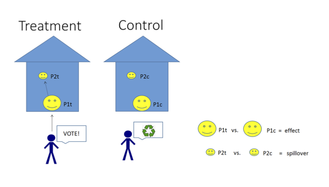
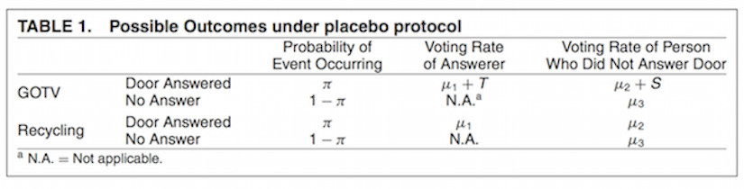

## Today

- Fixed effects
- RD designs 
- Spillover Effects


---

## Panel data

```{r, echo=FALSE}
load("~/Dropbox/Academic/UC_Berkeley/GSI/PS_231B/Section_slides/Section_11/country_data.Rda")
```

Panel data (also known as longitudinal data) is a data set in which the behavior of entities are observed across time. These entities could be states, companies, individuals, countries, etc.

```{r}
head(country_data)
```

---

```{r, echo=FALSE,message=FALSE}
#install.packages("gplots")
library(gplots)
```

For this exercise, we will focus on the heterogeneity across countries:

```{r, fig.height=4, fig.width=9}
par(mfrow=c(1,2))
plotmeans(y ~ country, main="Heterogeineity across countries", data=country_data)
plotmeans(y ~ year, main="Heterogeineity across years", data=country_data)
```

```{r, echo=FALSE}
par(mfrow=c(1,1))
```

---

Regular OLS does not consider heterogeneity across groups or time...

```{r, fig.height=4}
ols <-lm(y ~ x1, data=country_data)
summary(ols)
```
---

```{r, fig.height=5, fig.width=5}
par(mfrow=c(1,1))
plot(country_data$x1, country_data$y, pch=19, xlab="x1", ylab="y")
abline(lm(country_data$y~country_data$x1),lwd=3, col="red")

```

---

## Fixed effects

Fixed-effects models help to isolate the effects of within-unit variation---though coefficients are pooled across units.

$$ Y_{it}= \alpha_i + \beta D_{it} + \epsilon_{it} $$ where there is one dummy variable (``fixed effect") $\alpha_i$ for each unit $i$ (here unit=country). This fixed-effect is a unit-specific intercept.

How will the design matrix look here?

---

```{r}

fixed.dum <-lm(y ~ x1 + factor(country) - 1, data=country_data)
summary(fixed.dum)

```

---

Each component of the factor variable (country) is absorbing the variation particular to each country. 

```{r, echo=FALSE}
library(car)
```

```{r, fig.height=6, fig.width=6}

yhat <- fixed.dum$fitted
scatterplot(yhat~country_data$x1|country_data$country,
            xlab="x1", ylab="yhat", legend.coords="topright")
abline(lm(country_data$y~country_data$x1), lwd=5, col="black")


```


---

## Regression Discontinuity Design

 


---


## Regression Discontinuity Design

 


---

## Exercise

 

We will use `rddata.Rda` to estimate the effect of having a left-wing party in office on social spending

---

```{r}

load("~/Dropbox/Academic/UC_Berkeley/GSI/PS_231B/Section_slides/Section_11/rddata.Rda")
head(data)
```

---

```{r}

# How many municipalities?
length(unique(data$municipality))

# How many candidates per municipality?
nr_cand <- NA
for (i in 1:6000){ nr_cand[i] <- nrow(data[data$municipality==i,]) }
mean(nr_cand)
sd(nr_cand)

# NA observations for running variable?
sum(is.na(data$vs_2000))
```

---

What type of dataset do we need for the RD analysis? How can we build it?

---

```{r}
# Building RD dataset
rd_data <- NA

for (i in 1:6000){
    
    # get mini muni data
    temp <- data[data$municipality==i, ]
    # 1. keep winner and loser
    temp$order <- order(temp$vs_2000, decreasing = TRUE)
    temp <- temp[temp$order!=3, ]
    
    # 2. drop if no left
    temp$left <- ifelse(temp$party=="left", 1, 0)
    if (sum(temp$left)==0) {temp$margin <- NA}
    
    # 3. left margin
    if (sum(temp$left)==1){
        temp$margin <- temp$vs_2000[temp$left==1] - 
            temp$vs_2000[temp$left==0]}
    
    # put together in final dataset
    rd_data <- rbind(rd_data, temp)
    
    if (i/1000==round(i/1000)) print(i)
    
}
```

---

```{r}

head(rd_data)
```

---

```{r}
# dropping cases with no left wing party winner or runner up
rd_data <- rd_data[is.na(rd_data$margin)==F, ]
head(rd_data)
dim(rd_data)
length(unique(rd_data$municipality))
```

---

```{r}
# creating the treatment variable
rd_data$treat <- ifelse(rd_data$left==1 & rd_data$margin>=0, 1, 0)
table(rd_data$treat)

# keeping only the winner
rd_data <- rd_data[rd_data$order==1, ]
table(rd_data$treat)
```
---

```{r}

# t-test in 5% margin
with(rd_data[abs(rd_data$margin)<=5, ],
     t.test(soc_spend ~ treat))

```

Graphical representation of estimated effect across bandwidths (Bueno and Tuñón 2015)
===

```{r}

#Difference of means (using OLS with robust standard errors)
dom <- function(rescaled, treat, outcome){ model <- lm(outcome~treat)
est <- NA
est[1] <- model$coefficients[2]
est[2] <- sqrt(diag(vcovHC(model,type="HC3"))[2])
return(est) }

```


```{r}

# Plotting function
RD_plot <- function(
  
  # Data
  running=running,
  treat=treat,
  outcome=outcome,
  cutoff=0,
  min_running=F,
  max_running=F,
  
  # Intervals and Opt bw
  opt_bw=F, # opt bw
  nr_windows=50,
  
  # Estimator/s
  # Main Estimator
  main_est="dom",
  # estimator
  #confidence intervals
  ci="95%", #options: ci="90%", ci="F"
  
  #Plot aesthetics
  nr_obs=T,
  nr_obs_lab,
  label_x="Absolute distance from the cutoff",
  label_y="Estimated effect",
  plot_label="RD plot",
  label_size=1.2,
  main_size=2,
  legend=F # Keep false if desired output is grid of plots
  ){
  
  # WARNINGS
  if (cutoff==0) print("Assuming that cutoff is at the value of 0 for the running variable. \n 
                       To change this, input new value for the cutoff argument.")
  if (cutoff!=0) print("Rescaling the running variable to place cutoff at zero.")
  
  library("sandwich")
  print("This function requires the sandwich package")

  # DATA
  # 0. rescaling running var and organizing data 
  rescaled <- running - cutoff
  abs_running <- abs(rescaled)
  data <- cbind(rescaled, treat, outcome, abs_running, running)
  
  # 1. get windows from intervals and add optimal bandwidth
  min_running <- ifelse(min_running==F, 0, min_running-cutoff)
  max_running <- ifelse(max_running==F, max(abs_running), max_running-cutoff)
  windows <- seq(min_running, max_running,by=(max_running/nr_windows))[-1]
  if (opt_bw!=F) windows <- sort(c(windows, opt_bw))
  if (opt_bw!=F) print("Assuming optimal bandwidth measured as distance from the cutoff.")
  
  # 2. calculate estimate(s) and CI
  main <- dom
  ests <- matrix(NA,length(windows),3)
  for (i in 1:length(windows)){
    # select data
    temp <- as.data.frame(data[abs_running<=windows[i],])
    ests[i,1:2] <- with(temp, main(rescaled=rescaled, treat=treat, outcome=outcome))}
    
  # Confidence intervals for main estimate
  if (ci=="95%") CI <- cbind(ests[,1]+1.96*ests[,2],ests[,1]-1.96*ests[,2])
  if (ci=="90%") CI <- cbind(ests[,1]+1.64*ests[,2],ests[,1]-1.64*ests[,2])
  
  # Define max and min for y axis
  lim_y <- c(max(CI), min(CI))
  lim_y[3] <- lim_y[2] - (lim_y[1]-lim_y[2])/7
  lim_y[4] <- lim_y[1] - (lim_y[1]-lim_y[2])/11
  
  # Define max for x axis
  if (abs(opt_bw) > abs(max_running)) max_axis <- opt_bw
  if (abs(opt_bw) < abs(max_running)) max_axis <- max_running
  
  # 3. ordering to know number of observations by value of running variable
  data <- as.data.frame(data[order(abs_running),])
  if (nr_obs==T) {
    if (missing(nr_obs_lab))
      stop("Missing specification for number of observations to be included in the plot. \n
           If no axis for the number of observations is needed, use nr_obs=F.")
    nr_obs_lab <- cbind(nr_obs_lab, data$abs_running[nr_obs_lab])}
  
  # PLOT
  # Main line (add types, mins and maxs)
  if(legend==F){
    par(mar=c(4.1,6.1,6.1,2.1))
    plot(windows, ests[,1], pch=16, axes=T, 
         #limits
         ylim=c(lim_y[3],lim_y[1]),
         xlim=c(0, max_axis),
         #labels
         xlab=label_x, ylab=label_y, main=plot_label,
         bty='n', cex.main=main_size,
         cex.lab=label_size, 
         cex=1.2)
    #Zero effect line
    abline(h=0, lty=4, lw=3)
    #opt bw vertical line
    if(opt_bw!=F){
      abline(v=opt_bw, lty=5, col="gray80", lw=3)}
    
    # Add estimates line
    lines(windows, ests[,3], lwd=3,col="gray30")
    # CIs 
    if(ci!=F){
      lines(windows, CI[,1], lty=2,col="gray30")
      lines(windows, CI[,2], lty=2,col="gray30")}
    # Number of observations
    if (nr_obs==T) {
      axis(3, at=c(nr_obs_lab[,2]), labels=c(nr_obs_lab[,1]), cex=.6, col="grey50", 
           lwd = 0.5, padj=1, line=1, cex.axis=.7, col.axis="grey50")
      mtext("Number of observations", side=3, col="grey50", cex=.7, adj=0)}
  }
  
  if(legend==T){
  layout(rbind(1,2), heights=c(7,1))
  par(mar=c(4.1,6.1,6.1,2.1))
  plot(windows, ests[,1], pch=16, axes=T, 
       #limits
       ylim=c(lim_y[3],lim_y[1]),
       xlim=c(0, max_axis),
       #labels
       xlab=label_x, ylab=label_y, bty='n', 
       cex.lab=label_size, 
       cex=1.2)
  # title
  title(plot_label, cex.main=main_size, line=4)
  #Zero effect line
  abline(h=0, lty=4, lw=3)
  #opt bw vertical line
  if(opt_bw!=F){
  abline(v=opt_bw, lty=5, col="gray80", lw=3)}
  
  # Add estimates line
  lines(windows, ests[,3], lwd=3,col="gray30")
  # CIs 
  if(ci!=F){
    lines(windows, CI[,1], lty=2,col="gray30")
    lines(windows, CI[,2], lty=2,col="gray30")}
  # Number of observations
  if (nr_obs==T) {
    axis(3, at=c(nr_obs_lab[,2]), labels=c(nr_obs_lab[,1]), cex=.6, col="grey50", 
         lwd = 0.5, padj=1, line=1, cex.axis=.7, col.axis="grey50")
    mtext("Number of observations", side=3, col="grey50", cex=.7, adj=0)}
  
  # Legend
  par(mar=c(0.5,0,0,0))
  plot.new()
  main_leg <- "Difference of Means"
  if (ci=="95%") ci_leg <- paste("95% Confidence Intervals ", "(", main_leg, ")", sep="")
  if (ci=="90%") ci_leg <- paste("90% Confidence Intervals ", "(", main_leg, ")", sep="")
  
  legend("center", "groups", c(main_leg, ci_leg), pch=c(16, NA), lty=c(NA, 2), lwd=c(2, 2),
           col=c("black", "gray"), bty="n", cex=0.8)
  }
   
}


```


Plot our estimator across different bandwidths 
====

```{r}

RD_plot(running=rd_data$margin, treat=rd_data$treat, 
        outcome=rd_data$soc_spend, 
        cutoff=0, nr_windows=50, main_est="dom", ci="95%",
        nr_obs=T, 
        nr_obs_lab=c(30, 500, 1000, 1500, 2500, 3000, 4050),
        label_x="Absolute Distance from the Cutoff (Vote Margin %)",
        label_y="Average Difference in Social Spending \n Between left-wing party and the rest",
        plot_label=" ",
        legend=T)

```

Reduction in CIs (recall the trade-off between bias and precision)

---

## Nickerson (2008): Is Voting Contagious? 

In-house voter behavior is correlated, but how much of this is “contagion”

Strategy: Treat only one voter in two-voter households, but measure the outcome for both voters. 

Can we estimate the spillover effects by comparing treated and control households?

> - If you only compare treated and control, you don't know who would have answered the door for the control group. 

> - Why could this be a problem?

---

## Nickerson (2008): Is Voting Contagious? 

Idea: placebo treatment.

A placebo treatment allows to record who answers the door for both treatment and placebo group. 

By identifying “primary” contacted and “secondary” units in each household, the spillover effect can be estimated.

----






---

## Nickerson (2008): Is Voting Contagious? 

# The data 

```{r, echo=FALSE}

library(foreign)
data <- read.dta("contagion_apsr.replication.dta")

```

```{r}

head(data)

```

---

```{r}

table(data$reached, data$other)

table(data$treatment)

```

---

## Replication

```{r}

contacted <- data[data$hsecontact==1, ]

table(contacted$treatment)

contacted$treatment <- as.numeric(contacted$treatment==1)

table(contacted$treatment)

```

---

```{r}

direct <- with(contacted[contacted$reached==1, ],
               t.test(voted02p ~ treatment, alternative="less"))
direct

secondary <- with(contacted[contacted$other==1, ],
               t.test(voted02p ~ treatment, alternative="less"))
secondary

```

---

## Looking at balance in the Nickerson experiment

```{r, echo=FALSE}
contacted$gender <- as.numeric((contacted$gender=="F"))
contacted$party <- as.numeric((contacted$party=="DEMOCRATIC"))
```

```{r}

names(contacted)

with(contacted, t.test(age ~ treatment))$p.value
with(contacted, t.test(gender ~ treatment))$p.value
with(contacted, t.test(party ~ treatment))$p.value
with(contacted, t.test(voted01 ~ treatment))$p.value
with(contacted, t.test(voted00 ~ treatment))$p.value
with(contacted, t.test(voted00p ~ treatment))$p.value
with(contacted, t.test(voted99 ~ treatment))$p.value
with(contacted, t.test(voted98 ~ treatment))$p.value

```

But how would we test whether the *set* of covariates can jointly predict treatment assignment better than chance?

---

## The F-test 

The F-test is used to conduct a significant test for the joint hypothesis that all coefficients are zero. The null hypothesis is of the form  $H_0 : \beta_1 = \beta_2 = . . . = \beta_k = 0$.

We are comparing two models: one in which the coefficients of the pre-treatment covariates are allowed to vary and another in which they are constrained to zero. 

---

The test statistic is:

$F_{0}=\frac{(SSR_{r}-SSR_{ur})/q}{SSR_{ur}/(n-(k+1))}$

where $SSR_{r}$ stands for the sum of the squared residuals of the restricted model and $SSR_{ur}$ sum of the squared residuals of the unrestricted model. $n$ is the number of observations, $k$ is the number of independent variables in the unrestricted model and $q$ is the number of restrictions (or the number of coefficients being jointly tested).

---

The regression output in `R` reports the F-test:


```{r}

reg <- with(contacted, 
            lm(treatment ~ age + gender + party + voted01 + voted00 + voted00p + voted99 + voted98))

```

```{r}

summary(reg)

names(summary(reg))

summary(reg)$fstatistic

```

We can also calculate the F-test by hand. We first need $SSR_{ur}$. 

```{r}
SSRur <- sum(reg$residuals^2)
SSRur
```

What about $SSR_{r}$. What is this restricted model?

---

```{r}

regr <- with(contacted, lm(treatment ~ 1))

SSRr <- sum(regr$residuals^2)
SSRr

```

What are $n$, $q$ and $k$?

----

$n$ is the number of observations,
```{r}
n <- nrow(contacted)
```

$k$ is the number of independent variables in the unrestricted model
```{r}
reg$coefficients
length(reg$coefficients)
k <- length(reg$coefficients) - 1
```

and $q$ is the number of restrictions.
```{r}
q <- length(reg$coefficients) - 1
```

---

Recall $F_{0}=\frac{(SSR_{r}-SSR_{ur})/q}{SSR_{ur}/(n-(k+1))}$

```{r}

df1 <- q
df2 <- n-(k+1)

F0 <- ((SSRr-SSRur)/df1) / (SSRur/df2)
F0
```

---

```{r, echo=FALSE}
x <- seq(0, 5, .01)
y <- df(x=x, df1=df1, df2=df2)
plot(x, y, type="l", lwd=3, col="blue", main=paste0("F distribution with df1=",df1," and df2=",df2))
abline(v=F0, col="red", lty=3, lwd=2)
```


How do we calculate the p-value?

---

```{r}
F0
df1
df2

1 - pf(F0, df1=df1, df2=df2)

```

Does the validity of the test follow from the mechanical properties of OLS? What assumptions are we making?

We are assuming:

>- treatment assignment is a linear combination of the covariates.

>- normality of the error term in both regressions (where are we assuming this?)

Can we relax any of these assumptions?

---

## An alternative: randomization F-test

```{r}
library(ri)

perms <- genperms(Z=contacted$treatment)

dim(perms)

```


---

```{r}

perm_f <- NULL

for (i in 1:ncol(perms)){
    
    contacted$treat <- perms[,i]
    
    reg <- with(contacted, 
            lm(treat ~ age + gender + party + voted01 + 
                   voted00 + voted00p + voted99 + voted98))
    
    perm_f[i] <- summary(reg)$fstatistic[1]
    
}

head(perm_f)

perm_fdist <- density(perm_f)

```

```{r, echo=FALSE}

par(mfrow=c(1,2))

plot(x, y, type="l", lwd=3, col="blue", main=paste0("F distribution with df1=",df1," and df2=", df2))
abline(v=F0, col="red", lty=3, lwd=2)

plot(perm_fdist, lwd=3, col="blue", main="Permutation distribution of the F-test")
abline(v=F0, col="red", lty=3, lwd=2)

```

