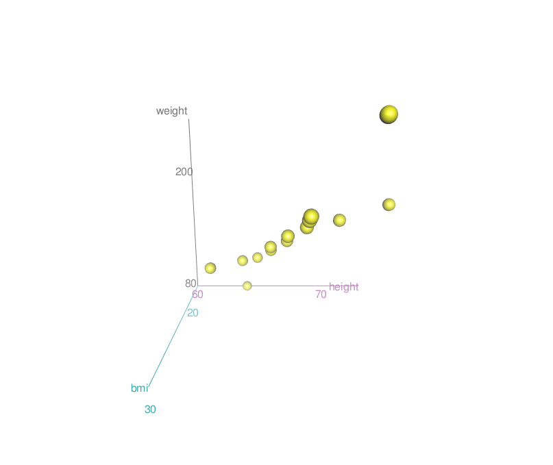
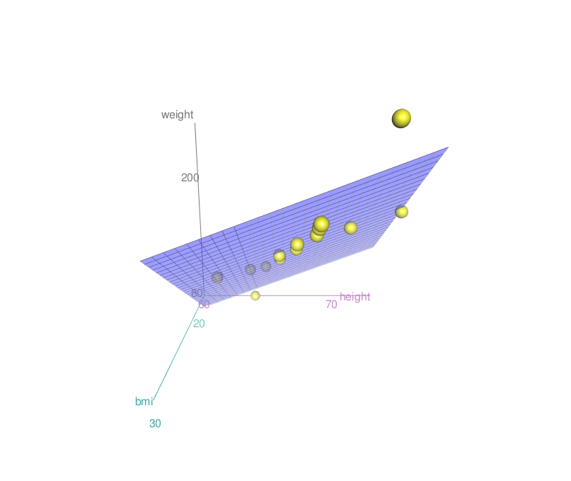
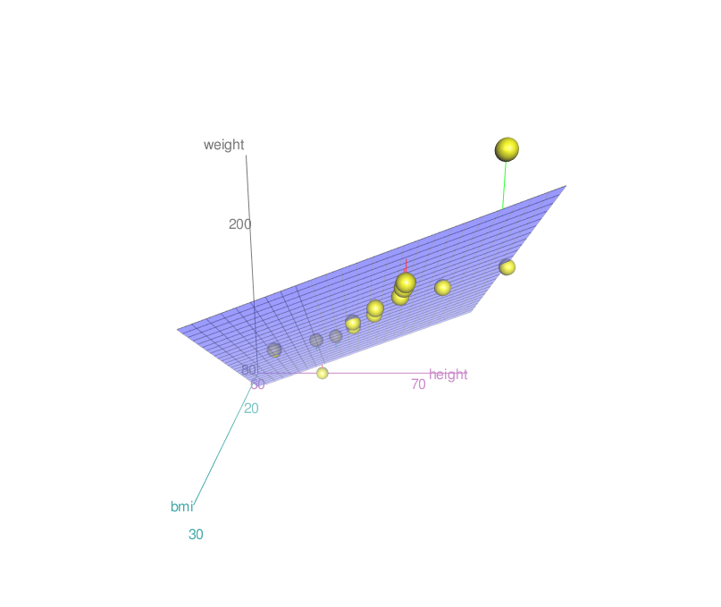

```{r, echo=FALSE}

rm(list=ls())
set.seed(94705)
# wd
setwd("~/Dropbox/Academic/UC_Berkeley/GSI/PS_231B/Section_slides/Section_4")

```

Today
===================================================

The mechanics of multivariate regression:

+ Matrix derivation
+ An example
+ Geometric interpretation

Libraries you will need for this section 
========================================================

```{r}

library(MASS)
library(car)
library(scatterplot3d)

```


1. Multivariate regression (matrix form)
===================================================

**NOTE:** *Remember that we are still talking about the mechanics of regression: statistical inference and causality are not yet in the picture... Everything follows from the algebra of MVR.*  

Suppose we have $n$ units. We can write $n$ equations for each unit as follows: 

$$
Y_i = \hat{\beta}_1 + X_{i1} \hat{\beta}_2 + X_{i2} \hat{\beta}_3 + \cdots + X_{ip} \hat{\beta}_{p+1} + e_i
$$

where $i = 1, 2, \cdots, n$. 

--- 

Now, we can also represent this set of equations as follows: 


$$
Y_i =  X_{i} \hat{\beta} + e_i 
$$
 Is $X_i$ a matrix or a vector? How does each one of these elements look like? How many of these equations should we have? 

---

Finally, we can also represent these equations using matrix notation: 

$$
Y = \mathbf{X} \mathbf{\hat{\beta}} + e_i 
$$

What are the dimensions of each component of the equation? How should each one look like?

> Note that, while we are using a "hat" for $\beta$, here we are not estimating parameters... yet.


The least-squares fit
====================================================

We are choosing $\hat{\beta}$ such that the sum of squared residuals is minimized. (We will see the geometric interpretation in the last part of section). Algebraically, 

\begin{aligned}
& \underset{\hat{\beta}}{\text{min}}
& &  e'e  
\end{aligned}


>- Why $e'e$? 


Some steps before we solve this optimization problem
====================================================

If $e = Y - \mathbf{X}\hat{\beta}$, then the sum of squared residuals ($S$) is: 

\begin{aligned}
S &= e'e \\
& = (Y-\mathbf{X}\hat{\beta})'(Y-\mathbf{X}\hat{\beta})
\end{aligned}

Which, we can simplify (using the rules of linear and transpose operators) as:

\begin{aligned}
S & = (Y' - \hat{\beta}'\mathbf{X}')(Y - \mathbf{X}\hat{\beta}) \\
& = Y'Y - Y'\mathbf{X}\hat{\beta} - \hat{\beta}' \mathbf{X}'Y + \hat{\beta}'\mathbf{X}'\mathbf{X}\hat{\beta} 
\end{aligned}

As in any optimization problem, what do we need to do next?

---

Find $\frac{\partial S}{\partial \hat{\beta}} = 0$. How many first order conditions are we going to have?

\begin{aligned}
 \frac{\partial S}{\partial \hat{\beta}} & = - 2 \mathbf{X'}Y + 2\mathbf{X}'\mathbf{X}\hat{\beta} = 0
\end{aligned}


How did we get there? Let's get back to the original objective function: 

\begin{aligned}
S = Y'Y - Y'\mathbf{X}\hat{\beta} - \hat{\beta}' \mathbf{X}'Y + \hat{\beta}'\mathbf{X}'\mathbf{X}\hat{\beta} 
\end{aligned}

>- Notice that the first term doesn't depend on $\hat{\beta}$

>- For the second and third terms we are using [matrix differentiation](http://www.atmos.washington.edu/~dennis/MatrixCalculus.pdf) in the form $\mathbf{A}\mathbf{Z}$ (or $\mathbf{Z}'\mathbf{A}$), where $\mathbf{A}$ doesn't depend on $\mathbf{Z}$.

>- For the last term, we use the fact that i) $\mathbf{\hat{\beta}}'\mathbf{A}\mathbf{\hat{\beta}}$ is the expression of the [quadratic form](https://www.khanacademy.org/math/multivariable-calculus/applications-of-multivariable-derivatives/quadratic-approximations/v/expressing-a-quadratic-form-with-a-matrix) with a matrix and ii) that it's derivative is [$2\mathbf{A}\hat{\beta}$](http://www.atmos.washington.edu/~dennis/MatrixCalculus.pdf). 

>- + What is $\mathbf{A}$ here?
>- + What are the dimensions of $\mathbf{X}'\mathbf{X}$? 

>- Then $\hat{\beta} = (\mathbf{X}'\mathbf{X})^{-1}\mathbf{X}Y$. Why? 

>- + Premultiply both sides by the inverse of $\mathbf{X}'\mathbf{X}$. 

>- + Identify identity matrix.

>- This expression implies that $\hat{\beta}$ only exists if the matrix $\mathbf{X}'\mathbf{X}$ is non-singular. That is, the det($\mathbf{X}) \neq 0$ (X is *full rank*).


Two facts about multivariate regression
====================================================

+ The residuals are orthogonal to $\mathbf{X}$ and, with an intercept, $\text{Cov} (e,\mathbf{X})=0$.
+ Also with an intercept, $e \perp \mathbf{X}$ implies that the average of the residuals is $0$. 

An example
====================================================

We will be using the `family.rda` dataset, which we can download directly from the internet.

```{r}
load(url("http://www.stat.berkeley.edu/users/nolan/data/stat133/family.rda"))
```


---

We will use height and bmi to predict weight. The following plot shows the relationship between weight and height, where the size of the points is proportional to bmi. Any pattern here?

```{r, echo=FALSE, fig.height=5.5, fig.width=6.5}

par(mfrow=c(1,1))

size <- (family$bmi)^2/sum(family$bmi) 

plot(family$height, family$weight, pch=16, cex=size, col="grey10")
abline(lm(family$weight ~ family$height), col="red", lwd=2)


```

---

+ We now know why $\hat{\beta}=(X'X)^{-1} X'Y$. 

+ We will use this to calculate $\hat{\beta}$ "by hand" in `R`.

+ For this, we will need `X` and `Y`. What should the dimensions of each of these be? How do we build them?

---

`Y` is easy. We just need a vector with the values for `weight`. 

```{r}

Y <- as.matrix(family$weight)

Y

```

What about `X`?

---

We will need to add a column of `1s` for the intercept and bind it to the `height` and `bmi` vectors.

Do we `rbind` or `cbind`?

---

```{r}

X <- as.matrix(cbind(1, family$height, family$bmi))

dim(X)

```

---

```{r}
X

```

---

**Exercise** Find $\beta$. 
Hints: `t()`,  `%*%`, `det()`, `solve()`.

---

Let's do this by parts. 

Part 1: $(X'X)$

```{r}

XprimeX <- t(X) %*% X

dim(XprimeX)

XprimeX

```

What does this matrix give us?

What happens when we get the inverse?

---

Part 2: $(X'Y)$

```{r}

XprimeY <- t(X) %*% Y

dim(XprimeY)

XprimeY

```

What about this one?

---

Let's put all of this together

```{r}

(solve(XprimeX)) %*% XprimeY

lm(Y~X[,2:3])

```

---

Geometric Interpretation of multivariate regression
====================================================

The "column space of $X$", $S(X)$, is the collection of all the points that can be expressed as $X\beta$, ie. that can be written as linear combinations of the columns in $X$. When $X$ is a matrix with two independent variables, this collection of points is a plane.


```{r, echo=FALSE}

rheight <- range(family$height) 
height <- seq(rheight[1], rheight[2], length = length(family$height))

rbmi <- range(family$bmi) ; 
bmi <- seq(rbmi[1], rbmi[2], length = length(family$bmi))

z <- outer(height, bmi)
```

---

The column space of X

```{r, echo=FALSE, fig.height=6}

persp(x = height, y = bmi, z = z, theta = 0, col="lightslateblue")

```

---

The column space of X

```{r, echo=FALSE, fig.height=6}

persp(x = height, y = bmi, z = z, theta = -50, col="lightslateblue")

```

---

The column space of X

```{r, echo=FALSE, fig.height=6}

persp(x = height, y = bmi, z = z, theta = -100, col="lightslateblue")

```

---

Observations


---

Observations + column space of $X$


---

The OLS problem: given $X$ and $Y$, find $\hat{Y}$, the points on $S(X)$ that are closest to $Y$. $\hat{Y}$ is often called the "orthogonal projection" of $Y$ onto the column space of $X$.

---

Orthogonal projection of $Y$ onto $S(X)$


Going back to the idea of "Variance Explained"
====================================================

$$
R^2 = \frac{\text{Var}(\mathbf{X\hat{\beta}})}{\text{Var}(Y)}
$$ 

We can also decompose the total variance of $Y$ as: 

$$
\text{Var}(Y) = \text{Var}(\mathbf{X}\hat{\beta}) + \text{Var}(e)
$$

> Remember that with multivariate regression, we are trying to get as close as we can to Y, given that we are lying on the "plane" that is spaned by all our columns in $\mathbf{X}$. 

To conclude...
====================================================

>- We have chosen $\hat{\beta}$ such that it minimizes the distance between $Y$ and $\mathbf{X}\hat{\beta}$ (i.e., $\hat{Y}$). Thus, mechanically (we showed this in lecture) $e'\mathbf{X} = 0$. With an intercept, $e\perp \mathbf{X}$ implies $\text{Cov}(\mathbf{X},e) = 0$
>- With an intercept, this implies that $\bar{e}= 0$. 
>- Causality is not yet in the picture, and neither is statistical inference.
